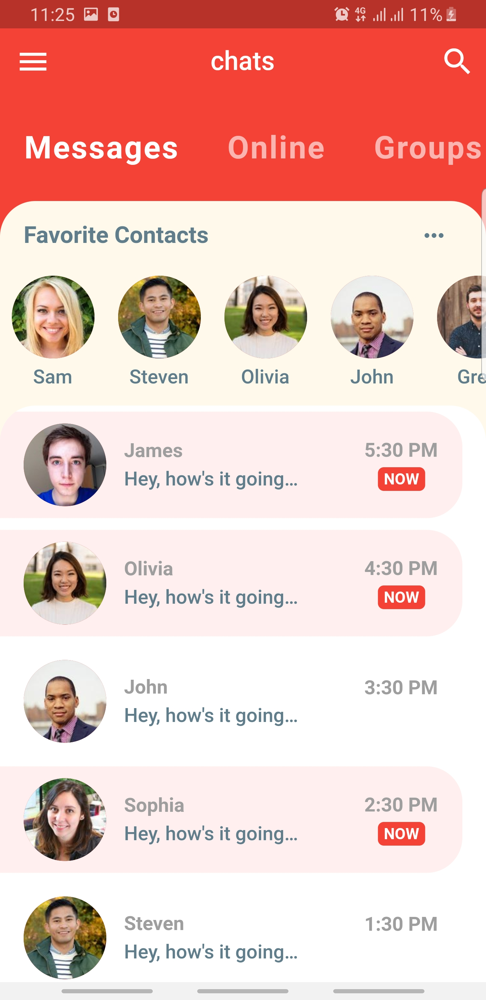
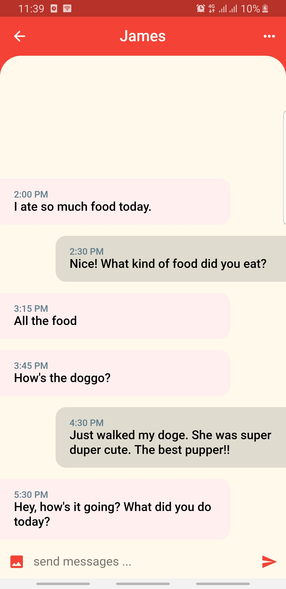

# Flutter Chat UI 

Cette application a été developper en suivant le tutoriel suivant : [Flutter Chat UI Tutorial | Apps From Scratch](https://www.youtube.com/watch?v=h-igXZCCrrc)

le design a été pris du site suivant : [Design](https://dribbble.com/shots/6428387-Messenger-Mobile-Concept)

  
  

